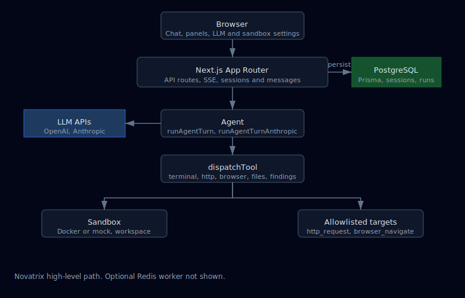

# Novatrix

Neo-style **autonomous security assessment** stack (chat UI + agent + sandbox + evidence). Use **only on systems you are authorized to test**.

**Repository:** [github.com/MaramHarsha/Novatrix](https://github.com/MaramHarsha/Novatrix)

## Project plan (how we got here)

The project evolved from a **Neo-inspired** autonomous assessment concept into **Novatrix** as a concrete monorepo: chat-driven objectives, tool execution, evidence, and scheduling—not a line-by-line clone of Neo, but the same *shape* of product (chat → agent loop → sandbox → findings).

| Phase | Focus |
|-------|--------|
| **Foundation** | Monorepo (`apps/web`, `packages/agent`, `packages/sandbox`), Prisma + Postgres, sessions/runs/messages, allowlisted `http_request` / `browser_navigate`, `terminal_exec`, `record_finding`. |
| **LLM breadth** | OpenAI-compatible and **Anthropic Claude** paths, shared tool dispatch, **retries** on rate limits, **`GET /api/llm/models`** + curated catalog ([LLM-MODELS.md](docs/LLM-MODELS.md)). |
| **Sandbox depth** | **Docker** vs **mock** modes, streamed terminal output, optional **Docker network** (`none` / `bridge`). |
| **Exegol** | Optional **community** offensive image (`nwodtuhs/exegol:*`); auto `--entrypoint` handling; docs in [EXEGOL.md](docs/EXEGOL.md). |
| **Dual profiles** | Per-session **Novatrix** + **Exegol** images from the UI; `sandbox_profile` on `terminal_exec`; **docker pull** when images/network change. |
| **Shipping & ops** | **GHCR** images (`novatrix-sandbox`, `novatrix-web`, `novatrix-worker`) via GitHub Actions; [beginner CI guide](docs/GITHUB-WORKFLOWS-BEGINNER.md). |
| **DX / deploy** | **LLM keys & models in the browser** (optional `.env`); **Ubuntu/AWS** one-shot script ([setup-ubuntu.sh](scripts/ubuntu/setup-ubuntu.sh), [DEPLOY-AWS-EC2.md](docs/DEPLOY-AWS-EC2.md)). |
| **UI** | Single-page **chat** + live **Terminal / Browser / HTTP / Network** panels + **findings**; session sandbox and LLM controls in the sidebar. |

**Parity checklist** vs public Neo docs: [neo-acceptance-matrix.md](docs/neo-acceptance-matrix.md).

## Tech stack

| Layer | Choices |
|-------|---------|
| **Web** | **Next.js 16.2** (App Router), React 19, TypeScript; SSE streaming for agent output. |
| **Agent** | Tool-calling loop: OpenAI Chat Completions + Anthropic Messages API; shared `dispatchTool` (`packages/agent`). |
| **Data** | **PostgreSQL** + **Prisma**; optional **pgvector** image for embedding experiments; `MemoryEntry` + OpenAI-compatible embeddings. |
| **Queue / jobs** | **Redis** + **BullMQ** (`apps/web/scripts/worker.mjs`) for post-run artifacts (optional). |
| **Sandbox** | Host **Docker CLI** (`docker run`) or **mock** shell; Tier-1 tools in `infra/docker/sandbox.Dockerfile`; optional **Exegol** image. |
| **Containers** | `docker-compose.yml` (Postgres + Redis); **GHCR** production images via [docker-ghcr.yml](.github/workflows/docker-ghcr.yml). |
| **Auth / safety** | Optional **`MUTATION_API_KEY`** for mutating APIs; **URL allowlists** for HTTP/browser tools. |

## System design (high level)

Architecture as a **vector diagram** (SVG) so it always appears as a picture on GitHub, in IDEs, and in PDFs—no Mermaid plugin required. Source file: [`docs/diagrams/novatrix-system-design.svg`](docs/diagrams/novatrix-system-design.svg).

<p align="center">
  
</p>

**Flow:** the user sends a **chat** message → **`POST /api/sessions/:id/messages`** loads **history** from Postgres, resolves **LLM** config (env + optional body from the UI), optionally **pulls Docker images**, then runs **`runAgentTurn`** / **`runAgentTurnAnthropic`** → tools execute in the **workspace** (filesystem under the run) and/or **Docker** (`terminal_exec`, `browser_navigate`) or **HTTP** (`http_request`) → assistant text streams back; **findings** persist to Postgres; optional **worker** consumes Redis for heavy exports.

## Documentation index

| Document | Description |
|----------|-------------|
| [docs/LLM-MODELS.md](docs/LLM-MODELS.md) | Providers, model IDs, Ollama, rate limits, **browser UI keys** vs `.env`. |
| [docs/DEPLOY-AWS-EC2.md](docs/DEPLOY-AWS-EC2.md) | **AWS EC2** deployment: Node, Postgres, PM2, Nginx, TLS, checklist. |
| [docs/GITHUB-WORKFLOWS-BEGINNER.md](docs/GITHUB-WORKFLOWS-BEGINNER.md) | **GitHub Actions** + **GHCR** beginner guide (workflows, pulls, troubleshooting). |
| [docs/EXEGOL.md](docs/EXEGOL.md) | Using **Exegol** as an optional sandbox image (Docker Hub tags, entrypoint, scope). |
| [docs/neo-acceptance-matrix.md](docs/neo-acceptance-matrix.md) | **Neo doc parity** checklist (sandboxes, tools, evidence, memory, scheduling). |

**Also useful:** [`docs/diagrams/novatrix-system-design.svg`](docs/diagrams/novatrix-system-design.svg) (system design diagram source), [`infra/docker/tools.manifest.yaml`](infra/docker/tools.manifest.yaml) (bundled CLI inventory + Exegol hint), [`scripts/ubuntu/setup-ubuntu.sh`](scripts/ubuntu/setup-ubuntu.sh) (Ubuntu/AWS bootstrap), [`.env.example`](.env.example) (environment template).

## Quick start

1. **Clone**

   ```bash
   git clone https://github.com/MaramHarsha/Novatrix.git
   cd Novatrix
   ```

2. **Start Postgres**

   ```bash
   docker compose up -d
   ```

3. **Environment**

   **Linux / macOS:**

   ```bash
   cp .env.example .env
   ```

   **Windows (cmd):** `copy .env.example .env`

   Set **`OPENAI_API_KEY`** / **`ANTHROPIC_API_KEY`** in `.env` **or** leave them empty and configure keys in the **LLM (browser only)** sidebar (saved in `localStorage`, sent each chat). Use **any model id** your provider supports (`OPENAI_MODEL` / `ANTHROPIC_MODEL`). For **Ollama** locally: `LLM_PROVIDER=openai`, `OPENAI_BASE_URL=http://127.0.0.1:11434/v1`, `OPENAI_API_KEY=ollama`, and `OPENAI_MODEL` from `ollama list`.

   Full catalog, Ollama steps, and **OpenAI vs Anthropic rate limits** (with official doc links): **[docs/LLM-MODELS.md](docs/LLM-MODELS.md)**. Curated JSON: **`GET /api/llm/models`**.

   Embeddings / session memory use `OPENAI_API_KEY` when set; without it, memory retrieval is skipped.

   Adjust `TARGET_ALLOWLIST` to match your lab targets (comma-separated URL prefixes).

4. **Database**

   ```bash
   npm install
   npm run db:push
   ```

5. **Dev server**

   ```bash
   npm run dev
   ```

   Open [http://localhost:3000](http://localhost:3000).

## Sandbox modes

- **`SANDBOX_MODE=docker`** (recommended in `.env.example`): commands run in Docker images — **required** for nuclei, httpx, Exegol, etc. Build/pull **`novatrix-sandbox:latest`** and enable **Exegol** in the UI (on by default for new chats):

  ```bash
  bash scripts/docker/build-novatrix-sandbox.sh
  bash scripts/docker/pull-exegol.sh
  ```

  If tools still look missing, check **`mock`** mode, image tags, or see [docs/EXEGOL.md](docs/EXEGOL.md).

- **`SANDBOX_MODE=mock`**: commands run on the **host** under `artifacts/runs/<runId>` — only a basic shell (curl/wget); **no** bundled scanners.
- **`SANDBOX_DOCKER_NETWORK`**: `bridge` (recommended for pulls and outbound scans) or `none` for egress isolation. New sessions default to **bridge** in the app.
- **Dual profile**: New sessions default to **Novatrix + Exegol** enabled; the agent picks `sandbox_profile` `"novatrix"` or `"exegol"` per `terminal_exec`. Exegol images use `--entrypoint /bin/bash` automatically. Details: [docs/EXEGOL.md](docs/EXEGOL.md).

## Pre-built images (GHCR)

CI workflow [`.github/workflows/docker-ghcr.yml`](.github/workflows/docker-ghcr.yml) builds and pushes **`novatrix-sandbox`**, **`novatrix-web`**, and **`novatrix-worker`** to `ghcr.io/<lowercase-github-owner>/…` on pushes to `main` (path-filtered), releases, and manual **workflow_dispatch**. Pull instead of building locally, for example `docker pull ghcr.io/<owner>/novatrix-sandbox:latest`. The app image is built from [`infra/docker/web.Dockerfile`](infra/docker/web.Dockerfile) (monorepo root context). **Beginner guide:** [docs/GITHUB-WORKFLOWS-BEGINNER.md](docs/GITHUB-WORKFLOWS-BEGINNER.md).

## Optional services

- **Redis + worker**: set `REDIS_URL`, then `npm run worker` to process BullMQ jobs (e.g. `REPORT.md` export after each run).
- **Scoped targets**: create a `Target` via `/api/projects` + `/api/projects/:id/targets`, then `PATCH /api/sessions/:id` with `targetId`. Allowlists merge env `TARGET_ALLOWLIST` with the target URL prefix.
- **Integrations**: `POST /api/integrations/slack` and `POST /api/integrations/github` when env vars from `.env.example` are set.
- **Doc parity checklist**: [docs/neo-acceptance-matrix.md](docs/neo-acceptance-matrix.md).

## npm scripts

| Script | Description |
|--------|-------------|
| `npm run dev` | Next.js dev server |
| `npm run build` | Production build |
| `npm run start` | Production server (`0.0.0.0:3000`) |
| `npm run db:push` | Apply Prisma schema to the database |
| `npm run db:studio` | Prisma Studio GUI |
| `npm run worker` | BullMQ worker (needs `REDIS_URL`) |

## Ubuntu server prep (AWS / bare metal)

Script: [`scripts/ubuntu/setup-ubuntu.sh`](scripts/ubuntu/setup-ubuntu.sh).

**Full stack in one go** (after `git clone` + `cd Novatrix`):

```bash
chmod +x scripts/ubuntu/setup-ubuntu.sh
INSTALL_DOCKER=1 NOVATRIX_FULL_SETUP=1 ./scripts/ubuntu/setup-ubuntu.sh
```

**Dependencies only** (then follow Quick start yourself):

```bash
chmod +x scripts/ubuntu/setup-ubuntu.sh
INSTALL_DOCKER=1 ./scripts/ubuntu/setup-ubuntu.sh
```

See the script header for `NOVATRIX_CLONE_URL`, `SKIP_DB_PUSH`, `SKIP_BUILD`, and other options. Full EC2 guide: **[docs/DEPLOY-AWS-EC2.md](docs/DEPLOY-AWS-EC2.md)** (also listed under [Documentation index](#documentation-index) above).

## License

MIT (app code). Third-party tools (nuclei, sqlmap, etc.) have their own licenses — see `infra/docker/tools.manifest.yaml`.
